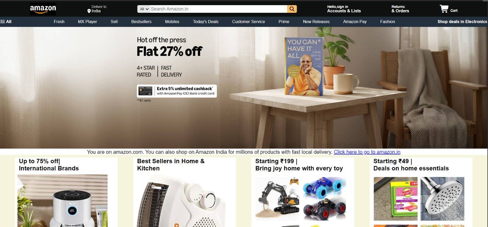
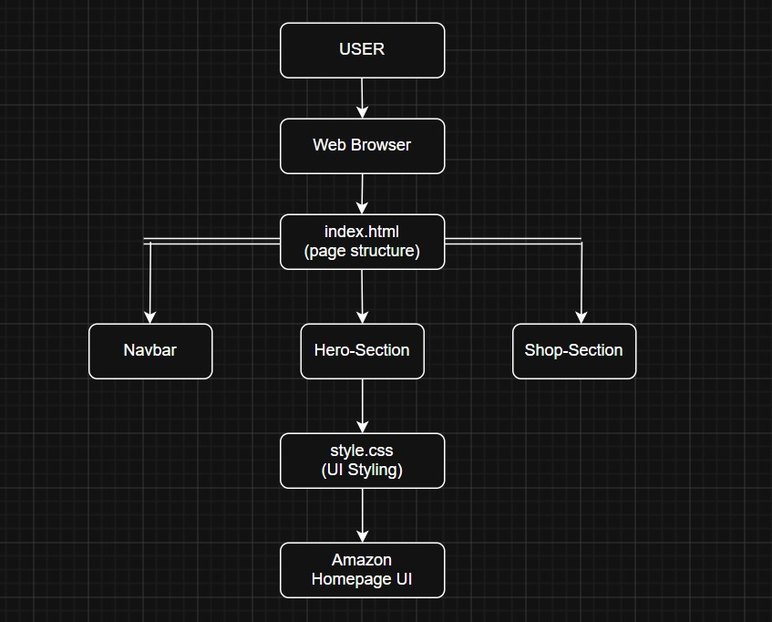

# 🛒 Amazon Homepage Clone

A modern Amazon-inspired homepage clone built using **HTML5** and **CSS3**. This project was created as part of frontend development practice to strengthen skills in layout design, Flexbox, and responsive web development principles.

---

## 🚀 Live Demo

Explore the Amazon Homepage Clone directly in your browser:

👉 **Live Website:**  
https://namanjainb3-tech.github.io/amazon-homepage-clone/

> Best viewed on desktop/laptop screens.

---

## 📸 Preview



---

## 🏗️ System Architecture



---

## 🌟 Features

* Amazon-style navigation bar
* Search bar interface
* Product showcase sections
* Hero banner design
* Flexbox-based layout
* Hover effects and styling
* Clean and organized code structure

---

## 📌 About the Project

This project recreates the visual structure of Amazon's homepage using only HTML and CSS. The goal was to gain hands-on experience with real-world webpage layouts, UI replication, and frontend development best practices.

The project focuses on:

* Semantic HTML structure
* CSS styling and positioning
* Flexbox layouts
* Component organization
* User Interface design fundamentals

---

## 🛠️ Tech Stack

| Technology | Purpose                              |
| ---------- | ------------------------------------ |
| HTML5      | Structure and content                |
| CSS3       | Styling and layout                   |
| Flexbox    | Responsive alignment and positioning |

---

## 📂 Project Structure

```text
Amazon-Homepage-Clone/
│
├── index.html
├── style.css
├── amazon-clone.mp4
│
├── assets/
│   ├── Amazon-Logo.png
│   ├── Amazon-Emblem.jpg
│   ├── hero-image.jpg
│   ├── india.png
│   ├── appliance-*.jpg
│   ├── bike-*.jpg
│   ├── book-*.jpg
│   ├── kitchen-*.jpg
│   ├── shopping*.jpg
│   └── toy-*.jpg
│
├── screenshots/
│   └── homepage.png
│
└── docs/
    └── architecture.png
```

---

## 🚀 Getting Started

### Clone the Repository

```bash
git clone https://github.com/your-username/amazon-homepage-clone.git
```

### Open the Project

Simply open `index.html` in your browser.

No additional dependencies or installations are required.

---

## 📚 Learning Outcomes

Through this project, I learned:

* Building structured web pages using HTML
* Creating responsive layouts with Flexbox
* Organizing CSS efficiently
* Replicating real-world website designs
* Improving frontend development fundamentals

---

## 📱 Responsive Design

This project was primarily developed and tested on laptop screens.

### Best Viewing Experience
- Browser zoom: **60% – 70%**
- Laptop/Desktop screens

### Current Limitation
The layout is not fully responsive yet and may not display perfectly on:
- Mobile devices
- Tablets
- Large monitor resolutions
- 100% browser zoom on some screens

---

## 🚀 Future Improvements

* Make the website fully responsive for mobile devices
* Add JavaScript-based interactions
* Implement a functional search bar
* Create a shopping cart interface
* Add product sliders and animations
* Improve accessibility and performance

---

## ⚠️ Disclaimer

This project is created solely for educational and learning purposes.

Amazon, its logo, and all related trademarks are the property of Amazon.com, Inc. This project is not affiliated with, endorsed by, or associated with Amazon in any way.

---

## 👨‍💻 Author

**Naman Jain**

* CSE Student at IIIT Sonepat
* Passionate about Software Development, AI, and Building Real-World Projects

⭐ If you found this project useful, consider giving it a star.

